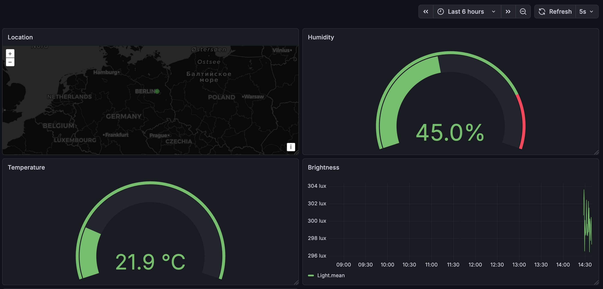

To run the server room environment monitoring:

1. Create "RPi3" InfluxDB database
2. Start mosquitto mqtt broker on localhost:1883
3. Run main.py (ssh to Raspberry Pi if running in harware mode)
4. Run receiver.py

# Server Room Monitoring System
 
An IoT-based monitoring system that collects real-time data from sensors in a server room, transmits the data over MQTT, stores it in InfluxDB, and visualizes it using Grafana.
 
## Architecture

```
Raspberry Pi                        Laptop
────────────────────────            ──────────────────────────
main.py                             receiver.py
  │                                    │
  │  sensors read data                 │  receives MQTT messages
  │  publish to MQTT ───────────►      │  writes to InfluxDB
                                       │
                                       ▼
                                    InfluxDB
                                       │
                                       ▼
                                    Grafana Dashboard
```
 
## Sensors
 
| Sensor | Device | Data |
|--------|--------|------|
| Temperature & Humidity | DHT11 (Joy-Pi) | Temperature (°C), Humidity (%) |
| Brightness | Light Sensor (Joy-Pi) | Light level (lux) |
| Noise | Sound Sensor (Joy-Pi) | Noise detected (0/1) |
| Location | GPS Bricklet V3 (Tinkerforge) | Latitude, Longitude |
 
## Project Structure
 
```
server_room_monitoring/
│
├── main.py              # Entry point — starts all sensor threads
├── receiver.py          # Subscribes to MQTT and writes to InfluxDB
├── utils.py             # Shared utilities (publish_message, load_config)
├── config.json          # Sensor thresholds (create to set the thresholds)
├── gps_sensor.py        # GPS sensor (real + simulated)
├── dht11_worker.py      # Temperature & humidity sensor (real + simulated)
├── light_sensor.py      # Light sensor (real + simulated)
├── sound.py             # Sound sensor (real + simulated)
├── warning.py           # Buzzer & vibration motor (real + simulated)
│
└── logs/                # Auto-generated log files (one per sensor per run)
```
 
## Requirements
 
### Hardware (live mode)
- Raspberry Pi 3
- Joy-Pi board (DHT11, light sensor, sound sensor, LCD, buzzer, vibration motor)
- Tinkerforge GPS Bricklet V3
### Software
- Python 3.10+
- Mosquitto MQTT broker
- InfluxDB v1
- Grafana
## Installation
 
### 1 — Clone the repository
```bash
git clone <https://github.com/beksinska/server-room-monitoring-dashboard>
```
 
### 2 — Install Python dependencies
```bash
pip install paho-mqtt influxdb python-dotenv
```
 
### 3 — Set up config file

Create `config.json` with your thresholds:
```json
{
    "temperature": {"min": 18, "max": 30},
    "humidity":    {"min": 30, "max": 70}
}
```
 
### 4 — Set up environment variables
Create a `.env` file in the project root:
```
INFLUXDB_PASSWORD=your-password
```
 
### 5 — Install and start Mosquitto
```bash
brew install mosquitto
brew services start mosquitto
```
 
### 6 — Install and start InfluxDB
```bash
brew install influxdb
brew services start influxdb
```
 
Create the database:
```bash
influx
```
```sql
CREATE DATABASE RPi3
EXIT
```
 
### 7 — Install and start Grafana
```bash
brew install grafana
brew services start grafana
```
 
Open `http://localhost:3000` and sign in with `admin/admin`.
 
## Running the Project
 
### Simulation mode (no hardware required)
Open two terminals:
 
```bash
# Terminal 1: sensors publishing to MQTT
python main.py --simulation
 
# Terminal 2: receiver writing to InfluxDB
python receiver.py --simulation
```
 
### Live mode (Raspberry Pi)
```bash
# On the Raspberry Pi
python main.py
 
# On the laptop
python receiver.py
```
 
For live mode, update `HOST` in `receiver.py` to the Pi's IP address:
```python
HOST = "192.168.1.x"  # Pi's IP address
```
 
## Grafana Dashboard


 
Connect InfluxDB as a data source:
- **URL:** `http://localhost:8086`
- **Query language:** `InfluxQL`
- **Database:** `RPi3`
The dashboard includes the following panels:
 
| Panel | Query | Visualization |
|-------|-------|---------------|
| Temperature | `SELECT mean("temperature") FROM "DHT11"` | Time series |
| Humidity | `SELECT mean("humidity") FROM "DHT11"` | Time series |
| Brightness | `SELECT mean("brightness") FROM "Light"` | Time series |
| Noise Level | `SELECT mean("sound") FROM "Sound"` | Time series |
| GPS Location | `SELECT last("latitude"), last("longitude") FROM "GPS"` | Geomap |
| Temperature Status | `SELECT last("temperature") FROM "DHT11"` | Stat |
| Humidity Status | `SELECT last("humidity") FROM "DHT11"` | Stat |
 
## Data Transmission
 
Sensor data is published to the following MQTT topics:
 
| Topic | Sensor |
|-------|--------|
| `SRH/RPi3/DHT11/msg` | Temperature & Humidity |
| `SRH/RPi3/Light/msg` | Brightness |
| `SRH/RPi3/Sound/msg` | Noise |
| `SRH/RPi3/GPS/msg` | Location |
| `SRH/RPi3/warning` | Threshold warning |
 
Each message follows this format:
```json
{
    "time": "2026-04-08T10:00:00Z",
    "measurement": "DHT11",
    "tags": {"location": "server-room-1"},
    "fields": {"temperature": 22.3, "humidity": 45.1}
}
```
 
## Logging
 
Each sensor creates a new log file on every run under the `logs/` directory. Log filenames include the sensor name and a UTC timestamp:
 
```
logs/
├── dht11_20260408_100000.log
├── light_20260408_100000.log
├── sound_20260408_100000.log
└── gps_20260408_100000.log
```
 
Each log entry includes a precise UTC timestamp:
```
2026-04-08 10:00:01.123456, Temperature: 22.3°C, Humidity: 45.1%
```
 
## Warning System
 
If temperature or humidity exceeds the thresholds defined in `config.json`, a warning is triggered:
- **Live mode:** buzzer and vibration motor activate for 1 second
- **Simulation mode:** warning message printed to terminal
Thresholds are configured in `config.json`:
```json
{
    "temperature": {"min": 18, "max": 30},
    "humidity":    {"min": 30, "max": 70}
}
```
 
## Security Notes
 
- Never commit `.env` or `config.json` to version control
- Add both to `.gitignore`:
```
.env
config.json
logs/
```
- GPS data are sensitive. Use a local Mosquitto broker, not a public one
 
